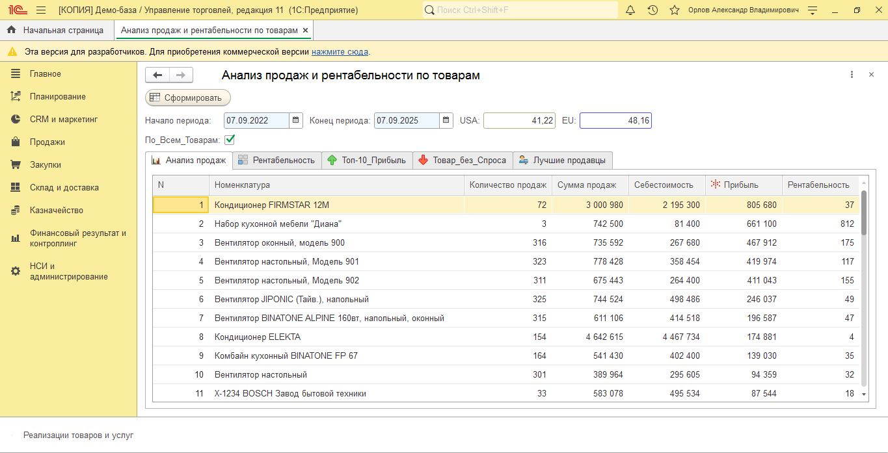

# 1c-sales-analytics
Анализ продаж и рентабельности для 1С:УТ 11

# 1C Sales Analytics Tool

`1C` `УТ 11` `аналитика` `продажи` `рентабельность`

## Обработка для анализа продаж и рентабельности в 1С:Управление торговлей 11

Многофункциональный инструмент для руководителей и менеджеров, предоставляющий полную аналитику по эффективности продаж.

### Возможности

- **Анализ продаж**: Детализация продаж по товарам за период
- **Рентабельность**: Расчет прибыли и рентабельности по каждому товару
- **Топ-10 товаров**: Рейтинги по количеству и сумме продаж
- **Товары без спроса**: Выявление непопулярных позиций
- **Лучшие менеджеры**: Анализ эффективности сотрудников
- **Курсы валют**: Автоматическое получение актуальных курсов с НБУ

### Технологии

- Встроенный язык 1С 8.3
- Сложные SQL-запросы с временными таблицами
- HTTP-запросы к внешнему API (НБУ)
- Работа с JSON

### Установка

1. Скачайте файл `sales_analytics.epf`
2. В конфигурации 1С перейдите в меню "Файл" → "Открыть" → выберите скачанный файл
3. Обработка готова к использованию

### Использование

1. Укажите период анализа
2. Выберите товар или установите флаг "По всем товарам"
3. Переключайтесь между вкладками для просмотра разных видов аналитики
4. Используйте кнопку "Сформировать" для получения данных

---

# 1C Sales Analytics Tool

`1C` `UT 11` `analytics` `sales` `profitability`

## Processing for sales and profitability analysis in 1C:Trade Management 11

Multifunctional tool for managers and executives providing complete sales performance analytics.

### Features

- **Sales analysis**: Detailed sales breakdown by items for the period
- **Profitability**: Profit and profitability calculation for each item
- **Top-10 items**: Ratings by quantity and sales amount
- **Low demand items**: Identification of unpopular positions
- **Best managers**: Employee performance analysis
- **Currency rates**: Automatic updating of exchange rates from NBU

### Technologies

- 1C 8.3 built-in language
- Complex SQL queries with temporary tables
- HTTP requests to external API (NBU)
- JSON processing

### Installation

1. Download `sales_analytics.epf` file
2. In 1C configuration go to "File" → "Open" → select downloaded file
3. The processing is ready to use

### Usage

1. Specify analysis period
2. Select item or check "All items" flag
3. Switch between tabs to view different analytics
4. Use "Generate" button to get data
